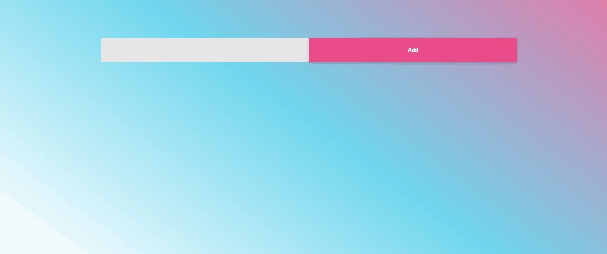
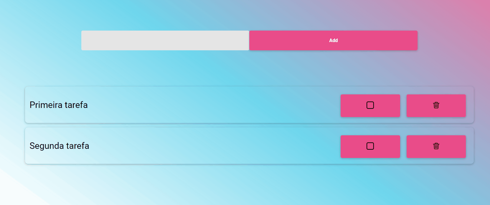

# Todo List React

<h3>Uma aplicação do tipo To do list feita em <a href="https://reactjs.org/docs/getting-started.html">React.js.</a> </h3>

<h2>Adicionando itens na lista.</h2>

<h4 align="center">
    
</h4>

<h2>Marcando itens como concluindo e excluindo os itens da lista.</h2>
<h4 align="center">
    
</h4>

 
##Tecnologias usadas:

<table>
 <tr>
  <td>HTML</td>
  <td>CSS</td>
  <td>BOOTSTRAP</td>
  <td>REACT</td>
  
 <tr>
  
 <tr>
  <td>5.0</td>
  <td>3.0</td>
  <td>5.2</td>
  <td>18.2.0</td>
 <tr>
 
</table>
 

Feito com :sparkling_heart: por João

Para mais informações<a href="https://www.linkedin.com/in/jo%C3%A3o-elias-maccari-99568a259/"> Entre em contato comigo!</a> 

 
